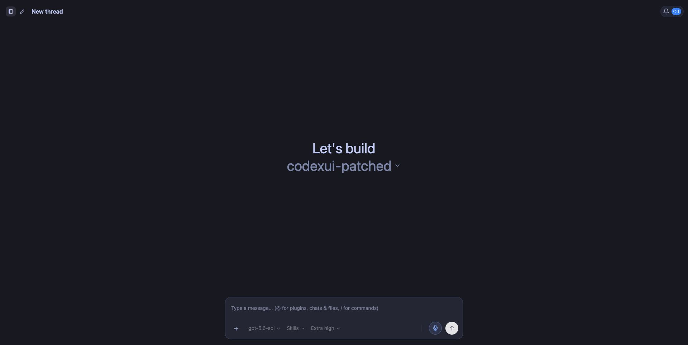
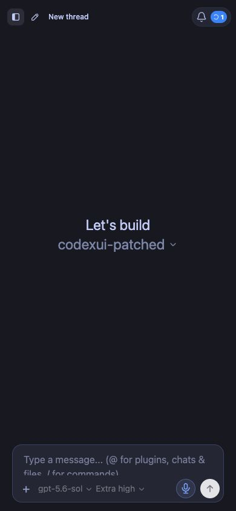

# CodexUI

**Your own Codex workspace, available from any browser.**

Run CodexUI on a Mac, Mac Mini, or Linux server. Then open it from your phone,
tablet, or laptop to work with the files and projects that stay on that machine.



<p align="center">
  
</p>

## What is CodexUI?

[Codex](https://developers.openai.com/codex/) is OpenAI's coding agent. It can
read a project, edit files, run commands, explain code, and help finish longer
tasks.

CodexUI gives that agent a friendly web interface. Instead of sitting in front
of the host computer, you can leave Codex running there and use it through a
browser from somewhere else.

This is especially useful with an always-on Mac Mini:

```text
Phone, tablet, or laptop
          ↓
     secure browser login
          ↓
Mac Mini running CodexUI
          ↓
projects and files on the Mac Mini
```

Your projects and Codex login remain on the host. CodexUI does not upload a copy
of your computer to this repository.

## What can it do?

- **Chat with Codex from anywhere.** Start a task on a laptop and check it from
  your phone.
- **Work across projects.** Choose a folder, keep chats grouped by project, pin
  important threads, and search old conversations.
- **Show the work as it happens.** Follow plans, tool calls, terminal commands,
  file changes, approvals, and results in real time.
- **Handle long conversations.** Older messages load as you scroll without
  making the whole page heavy.
- **Use Codex tools.** Browse installed skills, MCP connections, and plugins,
  then mention files, chats, or plugins directly in a message.
- **Schedule work.** Create one-time or repeating tasks, pause them, run them
  now, and review their history.
- **Get notified.** Use the Activity Center, browser push notifications, or
  optional Telegram alerts when work finishes.
- **Use voice and attachments.** Dictate a prompt or attach local files and
  images.
- **Work comfortably on mobile.** The layout, sidebar, composer, and controls
  adapt to smaller screens.
- **Choose how Codex thinks.** Pick the model and reasoning effort for each
  chat.

## Is it only for Mac?

No. CodexUI is built with Node.js and can run on macOS or a Linux server.

macOS—especially an always-on Mac Mini—is the best-documented setup in this
repository. Linux uses the same build and start commands, but you will need to
choose your own service manager, such as `systemd`. Windows is not currently a
documented server setup here.

Any device with a modern browser can be the screen: Mac, Windows, iPhone, iPad,
Android, or Linux.

## Try it locally on a Mac

You need:

- Node.js 18 or newer
- npm, which comes with Node.js
- the OpenAI Codex CLI
- a ChatGPT account with Codex access, or an OpenAI API key

Install Codex and sign in:

```bash
npm install --global @openai/codex
codex login
```

`codex login` opens the official browser sign-in flow. Each macOS user should
sign in separately if several people share one Mac.

Download and start CodexUI:

```bash
git clone https://github.com/jothamgoh/codexui-patched.git
cd codexui-patched
npm ci
npm test
npm run build
node dist-cli/index.js --no-tunnel --port 5999
```

Then open [http://localhost:5999](http://localhost:5999).

> [!NOTE]
> Install this version from GitHub. The npm package named `codexapp` is a
> separate project and does not contain the changes in this repository.

## Turn a Mac Mini into an always-on Codex host

The local test above stops when you close Terminal. To keep CodexUI running
after logout or restart:

1. Give the Mac user its own Codex login and project folders.
2. Copy [`.env.example`](.env.example) to `~/.config/codexui/.env`.
3. Put private settings in that file and keep it readable only by that user.
4. Build CodexUI with `npm ci`, `npm test`, and `npm run build`.
5. Start from the provided
   [macOS service template](deployment/macos/com.codexui.user.plist.example),
   replacing `USER`, the checkout path, port, and service name.
6. Put the public address behind Cloudflare Access or another secure login.

Create the private settings file:

```bash
mkdir -p ~/.config/codexui
cp .env.example ~/.config/codexui/.env
chmod 700 ~/.config/codexui
chmod 600 ~/.config/codexui/.env
```

The service template deliberately contains no passwords or API keys. Read
[`SECURITY.md`](SECURITY.md) before making the site reachable outside your home
network.

## Run it on a Linux server

The install and build commands are the same:

```bash
git clone https://github.com/jothamgoh/codexui-patched.git
cd codexui-patched
npm ci
npm test
npm run build
codex login
node dist-cli/index.js --no-tunnel --no-open-browser --port 5999
```

For a server without a convenient local browser, Codex also supports its
official device/browser authentication flows. After the first test, run the
process with `systemd` or another service manager so it starts after a reboot.

Do not open port `5999` directly to the internet. Put it behind an authenticated
gateway and HTTPS.

## Use it from a phone or another computer

CodexUI is a website, so there is no separate mobile app to install.

- On the same trusted network, open the host's private address and port.
- Away from home, open the hostname protected by your authenticated gateway.
- On iPhone or Android, you can add the page to the home screen for app-like
  access.
- Allow browser notifications if you want completion alerts.

The host computer must stay awake and CodexUI must stay running.

## One Mac, several people

Use a separate macOS account for each person. Give each account its own:

- Codex login and `~/.codex` folder
- CodexUI checkout and private `.env`
- project folders
- service name, port, and public hostname
- browser profile and connected services

This prevents one person's chats, files, browser sessions, Gmail connections,
skills, and scheduled tasks from silently appearing in another person's setup.
Sharing the same Homebrew installation is normally fine; the personal data
above is what needs to remain separate.

## Everyday shortcuts

`Cmd` is the Command key on a Mac. Use `Ctrl` for the equivalent shortcuts on
Windows or Linux where shown.

| What you want to do | Shortcut |
|---|---|
| Search chats | `Cmd K` / `Ctrl K` |
| Show or hide the sidebar | `Cmd B` / `Ctrl B` |
| Open the Activity Center | `Cmd J` |
| Start or stop dictation | `Cmd U` |
| Open visible chat 1–9 | `Cmd 1` … `Cmd 9` / `Ctrl 1` … `Ctrl 9` |
| Move a focused chat or project | `Option ↑` / `Option ↓` |
| Send a message | `Enter` |
| Add a new line | `Shift Enter` |
| Close a menu or dialog | `Esc` |

Type `@` to find plugins, chats, and files. Type `/` to find commands and
skills.

## Private settings

Common settings in `~/.config/codexui/.env` include:

- the default reasoning effort
- the public address used in notification links
- optional Telegram notification details
- browser push notification keys and state
- a custom Codex location or command

Keep real credentials outside the Git repository. Never commit a populated
`.env`, `auth.json`, OAuth token, browser profile, API key, or notification key.

## Updating

```bash
git pull --ff-only
npm ci
npm test
npm run build
```

Restart the background service only after the tests and build succeed. Do not
restart CodexUI from a chat that is currently running through that same
CodexUI process.

## Important security note

CodexUI is powerful because it can control Codex on the host computer. Anyone
who can use your CodexUI can potentially ask Codex to read files, change files,
or run commands with that user's permissions.

The built-in password is useful for a direct connection, but it is not enough
by itself when CodexUI sits behind a local reverse proxy. For a public hostname,
use Cloudflare Access or an equivalent identity-aware gateway. Never expose the
CodexUI port directly to the public internet.

Read the full [`SECURITY.md`](SECURITY.md) before remote deployment.

## For developers and AI agents

Most users can stop at the sections above. If you want to change CodexUI, start
with:

| File | What it explains |
|---|---|
| [`PROJECT_SPEC.md`](PROJECT_SPEC.md) | How the browser, server, state, and Codex bridge fit together |
| [`AGENTS.md`](AGENTS.md) | Rules for coding agents working on this repository |
| [`documentation/APP_SERVER_DOCUMENTATION.md`](documentation/APP_SERVER_DOCUMENTATION.md) | The Codex app-server protocol and schemas |
| [`.env.example`](.env.example) | Every supported private setting |
| [`SECURITY.md`](SECURITY.md) | The deployment trust boundary |

Development commands:

```bash
npm ci
npm run dev
```

Validation commands:

```bash
npm test
npm run build
```

## Project status and attribution

This is an independently maintained distribution. It began from the
MIT-licensed [`friuns/codexui`](https://github.com/friuns/codexui) codebase. The
original authors and license notice remain in [`LICENSE`](LICENSE).

Issues and focused pull requests are welcome.
